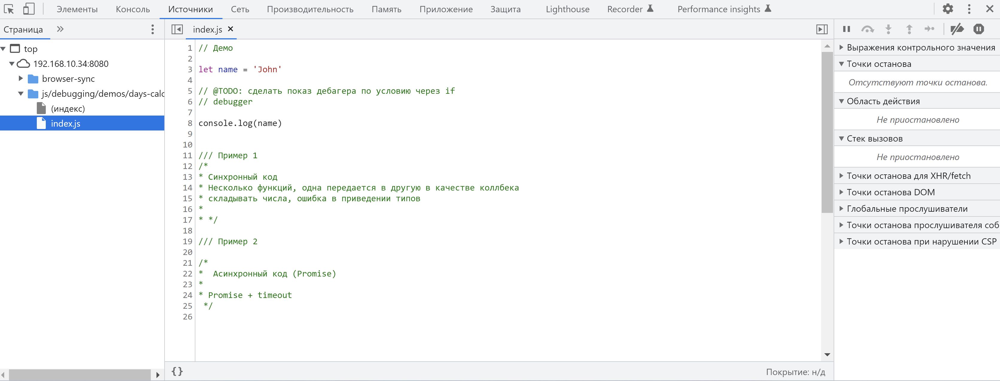
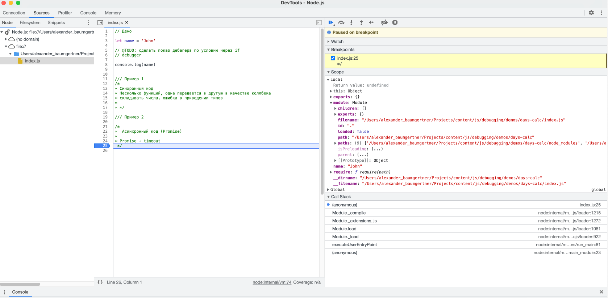

## Кратко

Отладка программы (выяснение причины ошибки и ее устранение) или "Дебаг" от английского слова [debug](https://ru.wikipedia.org/wiki/Debug) — важнейшее умение разработчика, так как обычно на выявление неисправности и исправление кода тратится значительно больше времени, чем на его написание и эффективность программиста во многом зависит от навыков отладки.
Самый простой дебаг — угадывание потенциальных мест ошибки и вывод переменных до/после кода с ошибкой в консоль с помощью `console.log`.
Отладка с помощью `console.log` не очень эффективный метод, например, если нужно вывести несколько переменных и/или переменные на разных этапах выполнения программы — консоль превращается в сложночитаемый список строк.
В этой статье мы рассмотрим дебаг с помощью `console.log` и более продвинутые способы — остановка и пошаговое выполнения кода.

## Основы отладки

Сначала определимся с тем, что мы ищем в коде.
Ошибки в программе могут быть двух видов – запуск программы аварийно завершается ошибкой или программа выдает неверные результаты.

- В первом случае достаточно открыть консоль браузера и вы увидите название ошибки и строку кода (если используется сборщик, нужно включить поддержку [sourcemaps](https://developer.chrome.com/blog/sourcemaps/)), где произошло исключение (exception), вызвавшее остановку выполнения кода. Подробнее такие ошибки описаны в [Error и стандартные ошибки](/js/errors/)
- Во втором случае причина неправильного результата может быть в ошибочном алгоритме, неявном приведении типов, случайном использовании присваивания `=` вместо сравнения `==`/`===` и тд.
Например
```js
let person = { name: 'John' }
if (person.name = 'Doe') {}
```

Такие ошибки сложнее обнаружить, так как программа выполняется, не падает в процессе, выдает какой-то результат но результат неверный.
Отладку значительно ускоряют и облегчают [тесты](/js/how-to-test-and-why/).

### Локализация ошибки

Первый шаг отладки — поиск возможных участков кода, где вероятно есть неисправности.
Определить точное место неисправного кода помогает разделение программы на части и проверка каждой части.

Для этого нужно:
- определить начало работы программы, откуда поступают данные;
- проследить методы/функции, которые обрабатывают эти данные;
- до и после этих методов/функций узнавать текущие значения переменных;
- не забыть учесть обработку условий if/else.

Обычно после беглого просмотра на опечатки разработчики запускают отладчик.

## Отладка с помощью консоли

Подавляющее большинство браузеров позволяет выводить данные в панель инструментов разработчика "Console".
Для вывода переменной, функции, класса нужно передать эти данные в фунцию `console.log`, например так:

```js
let name = 'John'

console.log(name)
```

Метод `log` выведет обычное сообщение в devtools. Кроме обычных сообщений можно вывести:
* `console.warn(name)` предупреждение. Текст будет желтого цвета
* `console.error(name)` ошибка. Текст будет красного цвета
* `console.table(name)` лог табличных данных (например, массива)

## Инструменты devtools

Современные инструменты разработчика в браузерах позволяют остановить и пошагово выполнить код  — во вкладке devtools "Oтладка кода".
В Chrome она называется "Sources", а в Firefox — "Debugger".
В этой вкладке отображается весь загруженный JS код для страницы. Если у сайта включены [sourcemaps](https://developer.chrome.com/blog/sourcemaps/), то будут доступен исходный код до транспиляции и сжатия для просмотра и выставления точек отстановки кода.


### Примеры

#### Safari


#### Firefox


#### Chrome


NB: Далее мы будем рассматривать работу отладчика в Chromium

### Оставка и продолжение выполнения кода

В devtools можно проставить точки остановки выполнения программы. Отладчик браузера встретив такую точку поставит выполнение кода на паузу и даст доступ к просмотру текущих значений переменных.
Этот способ отладки намного мощнее вывода в консоль, так как позволяет посмотреть все значения переменных без использования `console.log` а также делать остановку выполения кода по условию.

TODO: мы можем смотреть stack-frames в которых лежат переменные

Для указания точек остановки нужно открыть "Источники"

#### Русский


#### Английский



#### Пример подключения к NodeJS отладчику

Chrome позволяет подключаться к [NodeJS рантайму](https://nodejs.org/en/docs/guides/debugging-getting-started/#command-line-options) и выполнять отладку в средствах разработчика.

Например, можно запустить отладку кода примера этой статьи:
```shell
node --inspect-brk js/debugging/demos/days-calc/index.js
```


#### Просто остановка

Для остановки выполенния кода есть два способа:
- указать в коде программы `debugger`
- открыть в devtools вкладку Sources и кликнуть на левой части окна с кодом на номере строки


#### Остановка по условию

Добавленную точку остановки можно редактировать — задать остановку по условию: в поле ввода ввести выражение, возвращаемое значение true или false будет определять, останавливать или нет выполнение программы в этом месте.
TODO: Браузер: добавить и другие условия, например те что задаются из панели elements (правая кнопка + break on на смену классов и тд)

#### Стек вызовов

TODO: добавить пояснение
js/async-in-js/index.md

#### Продолжнение выполнения кода после остановки

После остановки есть возможность пошагово продолжить выполнение кода.
Существует несколько вариантов продолженения выполнения:

@TODO: сделать названия по-русски, в скобках указать английские
##### Step over line of code

##### Step into line of code

##### Step out of line of code

##### Run all code up to a certain line

#### Слежение за переменными (Watch expressions)

### Вывод переменных текущей области видимости в консоль

Вкладка отладки кода позволяет открыть консоль. В этой консоли будет доступ ко всем переменным текущей области видимости (текущего участка выполнения кода).

### Пример — отладка калькулятора дней

<iframe title="Отладка кода — Калькулятор дней — Дока" src="demos/days-calc/" height="280"></iframe>

